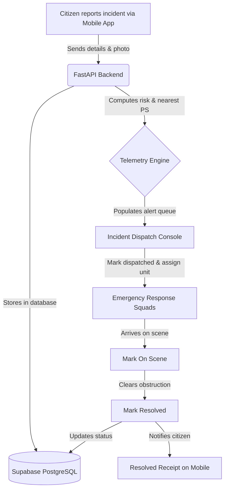

# ASTRAM – Bengaluru Smart Traffic Management & Emergency Response Platform

[](https://github.com/Sanjayduduka45/ASTRAM-Flipkart-Gridlock-2.0-Smart-Traffic-Management-Emergency-Response-System.git)
[](https://react.dev)
[](https://www.typescriptlang.org/)
[](https://tailwindcss.com)
[](https://fastapi.tiangolo.com)
[](https://www.python.org/)
[](https://supabase.com)
[](https://www.postgresql.org/)

ASTRAM is a next-generation, government-grade Smart Traffic Management, Incident Response, and Civic Telemetry Platform tailored for the urban challenges of Bengaluru. It integrates real-time traffic sensor streams, predictive bottleneck analysis, weather-impact modeling, and automated emergency resource dispatching with a civic complaint and route planning portal for citizens.

---

## 🚀 System Workflow



---

## 📋 Table of Contents
1. [Project Overview](#-project-overview)
2. [Key Features](#-key-features)
3. [System Architecture](#-system-architecture)
4. [HCI & Design Principles](#-hci--design-principles)
5. [Technology Stack](#-technology-stack)
6. [Project Structure](#-project-structure)
7. [Installation Guide](#-installation-guide)
8. [Future Enhancements](#-future-enhancements)
9. [License](#-license)

---

## 🔍 Project Overview

### The Problem Statement
Bengaluru is one of the most congested cities in the world, with traffic bottlenecks leading to massive economic loss, environmental damage, and delayed emergency response times. Heavy monsoon seasons exacerbate this issue, introducing hazards like waterlogging, tree falls, and accidents that stall traffic command networks.

### The Need for ASTRAM
Traditional traffic management relies on manual monitoring and disjointed systems. Bengaluru needs a unified, automated command center that bridges:
1. Real-time telemetry monitoring and bottleneck risk prediction.
2. Rapid verification and automated emergency resource allocation.
3. Accessible, real-time status alerts for citizens.

### The ASTRAM Solution
ASTRAM connects the **Traffic Police**, **BBMP Operations**, and **Emergency Services** under one unified dashboard, linked to a responsive **Citizen Mobile App**. By using AI-driven prediction models, live weather sensors, and direct Supabase database integrations, ASTRAM provides a closed-loop system where public complaints are received, verified, dispatched, resolved, and tracked dynamically.

---

## ✨ Key Features

### 🏢 Department Command Portal
* **Traffic Overview Dashboard**: Live telemetry grid displaying smooth vs heavy road metrics, active response squads, and real-time incident tickers.
* **Event Traffic Prediction**: Predicts future road closure probabilities and delay metrics for massive public gatherings (e.g., stadium sports, protests).
* **City Traffic Map**: An interactive Leaflet map rendering live traffic speeds, congestion overlays, barricades, response teams, and incidents.
* **Live Traffic Cameras**: AI-simulated CCTV cameras monitoring vehicle count, stream FPS, and queue lengths at critical junctions.
* **Problem Reports (Incident Management)**: Interactive dispatch console for operators to review, assign, and resolve emergency reports.
* **Public Reports**: Unified log feed of all citizen-submitted incident complaints.
* **Staff Allocation**: Status management for patrol police, towing units, pumping crews, and ambulances.
* **Traffic Insights**: Graphical analytics tracking congestion profiles, peak hours, and vehicle distributions.

### 📱 Citizen Mobile App (PWA Simulator)
* **Check Traffic**: Real-time traffic status, average vehicle speeds, and travel delays at critical Bengaluru junctions.
* **Best Route Planning**: Turn-by-turn interactive path navigation with alternate routing options and delay metrics.
* **Report Problems**: Form allowing citizens to upload Base64 photos, segment severity levels, count character descriptions, and submit geo-tagged complaints.
* **Camera / File Upload**: Multi-device image upload supports local file picking or WebRTC camera activation.
* **Road Closure Alerts**: Active warnings for blocked corridors and flooded roads.
* **Live Weather Updates**: Auto-polling Bengaluru weather sensors for rain warnings and temperature changes.
* **Emergency SOS**: Single-tap distress beacon to dispatch the nearest emergency responders with live ETAs.

---

## 🏗️ System Architecture

ASTRAM is structured into four cohesive operational layers:

```
┌────────────────────────────────────────────────────────┐
│                   Citizen Mobile Layer                 │
│  (Check Traffic · Report Incident · Route Navigation)  │
└──────────────────────────┬─────────────────────────────┘
                           ▼ (FastAPI / Supabase REST API)
┌────────────────────────────────────────────────────────┐
│                 Department Portal Layer                │
│  (Incident Command · Telemetry Metrics · Map Viewer)   │
└──────────────────────────┬─────────────────────────────┘
                           ▼ (Extra Trees Classifier / SHAP)
┌────────────────────────────────────────────────────────┐
│               Traffic Intelligence Layer               │
│  (Predictive Bottlenecks · Congestion Analytics)       │
└──────────────────────────┬─────────────────────────────┘
                           ▼ (Supabase PostgreSQL / psql)
┌────────────────────────────────────────────────────────┐
│                Emergency Response Layer                │
│   (Squad Dispatch · Resource Tracking · SOS Actions)   │
└────────────────────────────────────────────────────────┘
```

---

## 🎨 HCI & Design Principles

The ASTRAM system follows strict Human-Computer Interaction (HCI) standards:
* **Shneiderman's Golden Rules**:
  * **Strive for Consistency**: Navigation items, color-coded badges, and telemetry layouts use identical formatting throughout the app.
  * **Offer Informative Feedback**: Form submissions present a detailed digital receipt (ID, timestamp, status). Logging and updates trigger reactive visual indicators.
  * **Permit Easy Reversal**: Multi-stage forms (like incident reporting or route selection) allow citizens to modify selections, retake photos, and cancel actions cleanly.
* **Nielsen Heuristics**:
  * **Visibility of System Status**: A pulsing live status bar tracks active GPS connectivity and database streams.
  * **Flexibility and Efficiency of Use**: Unnecessary primary/secondary menu categorization was eliminated for a unified sidebar, reducing click fatigue.
* **Accessibility & Responsiveness**:
  * All touch targets maintain a minimum size of `44x44px` to comply with mobile layout guidelines.
  * Contrast ratios follow WCAG guidelines, ensuring readability on both desktop command screens and mobile screens.

---

## 🛠️ Technology Stack

ASTRAM is built using a modern, performant, and robust tech stack for real-time operations:

| Component | Tech / Tool | Badge |
| --- | --- | --- |
| **Frontend Framework** | React (v19) |  |
| **Language** | TypeScript |  |
| **Styling** | Tailwind CSS |  |
| **Analytics Charts** | Recharts |  |
| **Map Rendering** | Leaflet |  |
| **Build Tool** | Vite |  |
| **Backend Framework** | FastAPI |  |
| **Language** | Python (v3.13) |  |
| **ASGI Web Server** | Uvicorn |  |
| **Backend Database** | Supabase |  |
| **SQL Engine** | PostgreSQL |  |
| **Machine Learning** | scikit-learn / CatBoost |  |

---

## 📂 Project Structure

```
ASTRAM/
├── Data/                       # Dataset files (CSV, JSON reports)
├── serve/                      # Python FastAPI Backend
│   ├── main.py                 # Core API endpoints & Supabase connectors
│   ├── predictor.py            # AI traffic congestion predictor
│   └── schema.py               # Request/Response data models
├── models/                     # Trained ML models and preprocessors
├── pipeline/                   # Data preprocessing and feature engineering
├── frontend/                   # React + TypeScript Frontend
│   ├── public/                 # Static assets (including logo.jpg)
│   ├── src/
│   │   ├── components/         # Reusable UI widgets (Layout, Mobile app, Map)
│   │   ├── pages/              # Dashboard telemetry pages
│   │   ├── App.tsx             # Main component & global state router
│   │   ├── index.css           # Core styling system
│   │   └── types.ts            # Type declarations
│   ├── vite.config.ts          # Vite configuration with fs restrictions
│   └── package.json            # Node package configurations
├── supabase_schema.sql         # Supabase PostgreSQL schema definition
├── .env.example                # Example environment keys
└── run_astram.sh               # Local startup shell script
```

---

## 📦 Model Artifacts

For repository size optimization, trained model artifacts (`.pkl`) and datasets are excluded from version control.

The deployed prototype uses a fallback prediction engine when trained artifacts are unavailable.

To reproduce training:
```bash
python run_model_training.py
```

Generated artifacts will be stored locally in `/artifacts`.

---

## 💻 Installation & Deployment Guide

### Backend Setup

```bash
# Initialize and activate virtual environment
python -m venv venv
source venv/bin/activate  # On Windows: venv\Scripts\activate

# Install requirements
pip install -r requirements.txt

# Start backend server with reload
python -m uvicorn serve.main:app --reload
```

### Frontend Setup

```bash
# Navigate to frontend, install dependencies, and start dev server
cd frontend
npm install
npm run dev
```

### Railway Deployment

1. **Connect GitHub repository**: Link your GitHub repository to a new Railway project.
2. **Railway detects Procfile**: Railway will automatically detect the root-level `Procfile` and set up the start command.
3. **Add environment variables**: Define all required variables (e.g., Supabase keys, weather API endpoints) in Railway's service variables dashboard.
4. **Deploy**: Trigger manual or automatic deployment.
5. **Verify API health endpoint**: Confirm status by requesting the `https://<your-railway-url>/api/health` endpoint.

---

## 🔮 Future Enhancements

* **AI Traffic Forecasting**: Extend predictions to support multi-hour temporal horizon modeling.
* **Real-Time IoT Integration**: Connect physical sensor loops and CCTV cameras.
* **Smart Signal Optimization**: Deploy congestion-aware dynamic signal switching.

---

## 📄 License

Distributed under the MIT License. See `LICENSE` for more information.

